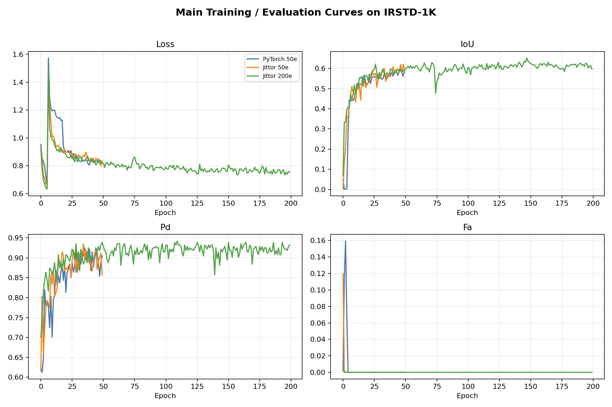
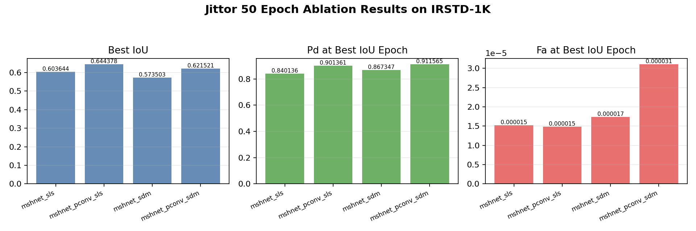

# PConv-SDM-Jittor：红外弱小目标检测复现

本仓库用于复现论文 **Pinwheel-shaped Convolution and Scale-based Dynamic Loss for Infrared Small Target Detection** 中面向 mask-based segmentation 的核心方法，并将 PyTorch 组合版迁移到 Jittor。

当前仓库已完成 PyTorch baseline、Jittor 迁移、Jittor 50 epoch 对齐、四组 Jittor 50 epoch 消融，以及 `mshnet_pconv_sdm` 200 epoch 主配置长训练。200 epoch Jittor 主结果为 IoU=0.652015、Pd=0.928571、Fa=0.00002573，优于 50 epoch Jittor 主配置。

## 项目目标

本项目不走 YOLO 检测框架路线，而是围绕红外弱小目标检测中的分割式实验设置，复现以下核心内容：

- MSHNet 分割 backbone
- Pinwheel-shaped Convolution，简称 PConv
- Scale-based Dynamic Loss，简称 SDM Loss
- IRSTD-1K 上的四组消融实验

计划完成的四组实验为：


| 实验组 | Backbone | 卷积模块 | Loss |
| ------ | -------- | -------- | ---- |
| 1      | MSHNet   | 普通卷积 | SLS  |
| 2      | MSHNet   | PConv    | SLS  |
| 3      | MSHNet   | 普通卷积 | SDM  |
| 4      | MSHNet   | PConv    | SDM  |

## 代码结构

本仓库参考 Jittor 复现仓库常见组织方式，采用“官方 PyTorch 参考代码 + 自整理 PyTorch 组合版 + Jittor 迁移版”的三层结构：

```text
PConv-SDM-Jittor/
  code/
    pconv_sdloss/        # PConv + SD Loss 官方 PyTorch 参考代码
    mshnet/              # MSHNet 官方 PyTorch 参考代码

  pytorch_pconv_sdm/     # 自整理的完整 PyTorch 组合版
    configs/
    dataset/
    models/
    losses/
    tools/
    train.py
    test.py

  jittor_pconv_sdm/      # Jittor 迁移版
    configs/
    dataset/
    models/
    losses/
    tools/
    train.py
    test.py

  scripts/               # 环境检查、数据准备、训练评估辅助脚本
```

## 参考代码来源

`code/` 目录只作为上游参考代码保存，后续不直接在其中开发。正式实现会整理到 `pytorch_pconv_sdm/` 和 `jittor_pconv_sdm/`。


| 参考内容         | 来源仓库                                     | 当前导入版本                               |
| ---------------- | -------------------------------------------- | ------------------------------------------ |
| PConv 与 SD Loss | https://github.com/JN-Yang/PConv-SDloss-Data | `a801f043c83f73aa9af9ab2f689e59ebef928fc4` |
| MSHNet backbone  | https://github.com/Lliu666/MSHNet            | `7c5194b8caeb3329ba8a67c75a6928d4dbeb3582` |

需要注意的是，PConv 官方仓库主要提供 PConv 与 SD loss 的参考实现，并不等价于完整的 `MSHNet + PConv + SDM` 分割复现工程。因此本项目会先构建一个干净的 PyTorch 组合版，作为 Jittor 迁移前的对齐基准。

## 复现路线

1. 引入官方 PyTorch 参考代码。
2. 整理 `MSHNet + PConv + SDM` 的 PyTorch 组合版。
3. 在本地完成 `py_compile`、shape check、loss forward 等轻量检查。
4. 在云端 GPU 上完成 PyTorch 轻量 smoke test。
5. 完成 Jittor 迁移初版，并对齐模型结构、PConv padding、loss 计算和训练入口。
6. 在云端 GPU 上完成 Jittor 轻量 smoke test。
7. 在官方 IRSTD-1K 上完成 Jittor 2 epoch debug。
8. 运行 Jittor 50 epoch 对齐实验。
9. 运行 IRSTD-1K 四组 50 epoch 消融，并整理 IoU、Pd、Fa 与可视化结果。
10. 对 `mshnet_pconv_sdm` 追加 200 epoch 长训练，检查主配置是否继续提升。

## PyTorch 轻量检查

当前 PyTorch 组合版已提供以下检查入口：

```bash
python pytorch_pconv_sdm/tools/check_env.py
python -m py_compile pytorch_pconv_sdm/train.py pytorch_pconv_sdm/test.py
python pytorch_pconv_sdm/tools/sanity_check.py
python pytorch_pconv_sdm/tools/smoke_train.py --max-iters 2 --config mshnet_pconv_sdm
```

云端 PyTorch 轻量验证已在 AutoDL RTX 3090 环境通过：

```text
Python 3.10.8
PyTorch 2.1.2+cu118
CUDA 11.8
GPU: NVIDIA GeForce RTX 3090
```

已通过的云端检查包括 `check_env.py`、`py_compile`、`sanity_check.py`，以及四组消融配置的 2-iteration smoke train。

训练入口示例：

```bash
python pytorch_pconv_sdm/train.py \
  --dataset-dir /path/to/IRSTD-1k \
  --config mshnet_pconv_sdm \
  --batch-size 4 \
  --epochs 400
```

测试入口示例：

```bash
python pytorch_pconv_sdm/test.py \
  --dataset-dir /path/to/IRSTD-1k \
  --weight-path /path/to/best_weight.pkl \
  --config mshnet_pconv_sdm
```

## 环境说明

推荐基础环境：

```text
Python 3.10
PyTorch 2.1.2
CUDA 11.8
Jittor stable release
```

当前 `requirements.txt` 只记录通用 Python 依赖。PyTorch 与 Jittor 的具体安装命令会根据本地或云端环境单独说明。

## 数据与输出

数据集、预训练权重、训练日志、checkpoint、可视化输出等大文件不会提交到仓库。它们应放在本地或云端工作目录中，并通过 `.gitignore` 排除。

建议目录命名：

```text
data/
weights/
checkpoints/
runs/
logs/
outputs/
```

## PyTorch 基准结果

官方 IRSTD-1K 上的 PyTorch 主配置 `mshnet_pconv_sdm` 已完成 50 epoch baseline：

```text
run dir: runs/pytorch_pconv_sdm_50epoch/mshnet_pconv_sdm-20260802-142726
best epoch: 45
IoU: 0.597179
Pd: 0.911565
Fa: 0.00001693
```

云端日志已归档到：

```text
/root/autodl-tmp/PConv-SDM-Jittor/logs/2026-08-02_05_pytorch_irstd1k_50epoch_baseline/
```

## Jittor debug 结果

官方 IRSTD-1K 上的 Jittor 主配置 `mshnet_pconv_sdm` 已完成 2 epoch debug：

```text
run dir: runs/jittor_pconv_sdm_debug/mshnet_pconv_sdm-20260802-154228
train.exit: 0
test.exit: 0
epoch=1 loss=0.871432
IoU: 0.141926
Pd: 0.527211
Fa: 0.00052153
```

云端日志已归档到：

```text
/root/autodl-tmp/PConv-SDM-Jittor/logs/2026-08-02_07_jittor_irstd1k_debug/
```

## Jittor 复现结果

官方 IRSTD-1K 上的 Jittor 主配置 `mshnet_pconv_sdm` 已完成 50 epoch 对齐和 200 epoch 长训练：

```text
50 epoch main:
best epoch: 48
IoU: 0.621521
Pd: 0.911565
Fa: 0.00003105

200 epoch main:
best epoch: 147
IoU: 0.652015
Pd: 0.928571
Fa: 0.00002573
```

50 epoch 四组消融结果：


| 配置               | PConv | Loss | best epoch |      IoU |       Pd |         Fa |
| ------------------ | ----- | ---- | ---------: | -------: | -------: | ---------: |
| `mshnet_sls`       | 否    | SLS  |         38 | 0.603644 | 0.840136 | 0.00001526 |
| `mshnet_pconv_sls` | 是    | SLS  |         38 | 0.644378 | 0.901361 | 0.00001488 |
| `mshnet_sdm`       | 否    | SDM  |         49 | 0.573503 | 0.867347 | 0.00001738 |
| `mshnet_pconv_sdm` | 是    | SDM  |         48 | 0.621521 | 0.911565 | 0.00003105 |

精简结果文件与三张预测可视化见 `results/irstd1k_reproduction/`。完整训练日志、run 目录、权重和 checkpoint 不提交到 GitHub，仅保存在本地归档。

训练过程曲线和消融对比图：





更完整的复现过程说明见 `docs/reproduction_notes.md`。

## 结果记录与归档策略

本仓库保留适合公开展示和复查的轻量结果：

```text
results/irstd1k_reproduction/
  README.md
  ablation_table.csv
  best_metrics.log
  metrics/*.csv
  figures/*.png
  visualizations/*.png
```

以下内容不提交到 Git 历史中：

```text
logs/
runs/
*.pkl
best_weight.pkl
checkpoint.pkl
datasets/
.ipynb_checkpoints/

```

权重、checkpoint、完整日志和完整云端工作区已保存在本地归档，不上传至仓库中。

## 复现推进记录

- [X]  建立正式仓库目录
- [X]  引入 PConv / SD Loss 参考代码
- [X]  引入 MSHNet 参考代码
- [X]  完成 PyTorch 组合版
- [X]  完成 PyTorch 轻量验证
- [X]  完成 PyTorch 50 epoch baseline
- [X]  完成 Jittor 迁移初版代码
- [X]  完成 Jittor 轻量验证
- [X]  完成 Jittor 真实数据 2 epoch debug
- [X]  完成 Jittor 50 epoch 对齐实验
- [X]  完成四组正式消融实验
- [X]  完成 Jittor 200 epoch 主配置长训练
