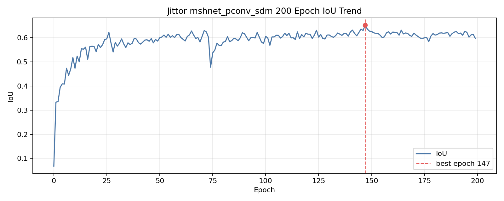

# IRSTD-1K 复现实验结果

本目录保存适合放入 GitHub 的轻量实验结果证据。完整训练日志、完整 `runs/`、数据集、权重、checkpoint、Jittor 缓存和云服务器凭据不放入仓库，只保存在本地归档。

## 实验设置

- 数据集：IRSTD-1K
- 输入尺寸：`base_size=256`，`crop_size=256`
- batch size：4
- 主配置：`mshnet_pconv_sdm`
- 评价指标：在 test split 上使用 `best_weight.pkl` 计算 IoU、Pd、Fa

云端运行 Jittor 时需要先设置：

```bash
export LD_PRELOAD=/usr/lib/x86_64-linux-gnu/libstdc++.so.6
```

## 主结果

| 实验 | 训练轮数 | best epoch | IoU | Pd | Fa |
| --- | ---: | ---: | ---: | ---: | ---: |
| PyTorch `mshnet_pconv_sdm` baseline | 50 | 45 | 0.597179 | 0.911565 | 0.00001693 |
| Jittor `mshnet_pconv_sdm` 对齐实验 | 50 | 48 | 0.621521 | 0.911565 | 0.00003105 |
| Jittor `mshnet_pconv_sdm` 主结果 | 200 | 147 | 0.652015 | 0.928571 | 0.00002573 |

200 epoch Jittor 主结果在 IoU 和 Pd 上均优于 50 epoch Jittor 主配置，同时 Fa 也更低。因此 50 epoch 结果更适合作为迁移对齐参照，200 epoch 结果作为当前主结果。

## 训练过程曲线




说明：这里的 loss 和指标来自每个 epoch 记录的 `metrics.log`，不是 batch-level 曲线。

## 50 epoch 消融

| 配置 | PConv | Loss | best epoch | IoU | Pd | Fa | 说明 |
| --- | --- | --- | ---: | ---: | ---: | ---: | --- |
| `mshnet_sls` | 否 | SLS | 38 | 0.603644 | 0.840136 | 0.00001526 | MSHNet + SLS 基线 |
| `mshnet_pconv_sls` | 是 | SLS | 38 | 0.644378 | 0.901361 | 0.00001488 | 50 epoch 消融中 IoU 最高 |
| `mshnet_sdm` | 否 | SDM | 49 | 0.573503 | 0.867347 | 0.00001738 | 单独加入 SDM 在本设置下较弱 |
| `mshnet_pconv_sdm` | 是 | SDM | 48 | 0.621521 | 0.911565 | 0.00003105 | 50 epoch 消融中 Pd 最高 |


## 预测可视化

`visualizations/` 中保留 3 张精选四联图，用于 README、PPT 和视频汇报。四联图包含原图、GT mask、预测 mask 和预测叠加图。

## 文件说明

- `ablation_table.csv`：保留的关键结果表。
- `best_metrics.log`：PyTorch baseline、Jittor 50 epoch 对齐、50 epoch 消融和 Jittor 200 epoch 主结果的 best metric 行。
- `metrics/*.csv`：由完整 `metrics.log` 转换得到的 epoch-level 指标表。
- `figures/*.png`：由 `metrics/*.csv` 生成的训练过程曲线和消融对比图。
- `pytorch_baseline_50epoch_metrics_tail.log`：PyTorch 50 epoch baseline 的 metrics tail。
- `jittor_main_50epoch_metrics_tail.log`：Jittor 50 epoch 主配置的 metrics tail。
- `jittor_50epoch_ablation_summary.md`：Jittor 三组补充消融和复用主配置的摘要。
- `jittor_main_200epoch_summary.md`：Jittor 200 epoch 主配置长训练摘要。
- `jittor_main_200epoch_metrics_tail.log`：Jittor 200 epoch 主配置的 metrics tail。
- `visualizations/*.png`：精选预测可视化图。
